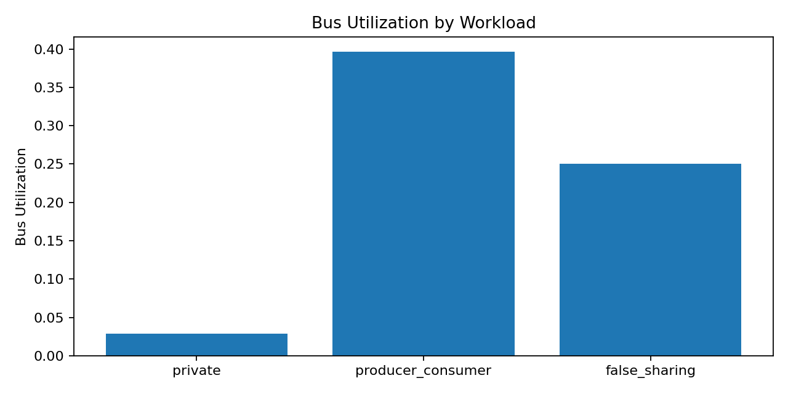
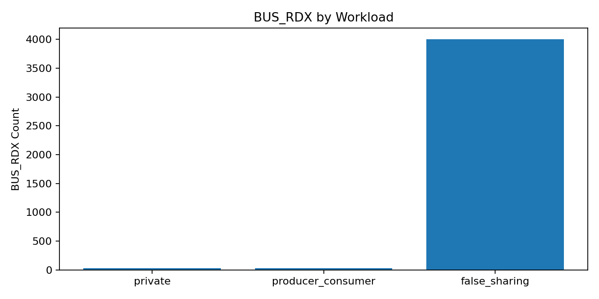

# MESI Cache Coherence Controller (2-core)

A fully synthesizable 2-core MESI cache coherence controller implemented in SystemVerilog with a snooping bus arbiter, SVA protocol assertions, and a Python golden-model simulator.

- **Protocol:** MESI (Modified / Exclusive / Shared / Invalid)
- **Topology:** 2× L1 (2-way set-associative, write-back) + snooping bus arbiter + shared L2
- **Target:** Xilinx Artix-7 xc7a35tcpg236-1 (Basys3 / Arty)
- **Achieved Fmax:** ~50.4 MHz (WNS = +0.155 ns, zero timing violations post-implementation)

---

## Repository Structure

```
rtl/                        Synthesizable SystemVerilog RTL
  mesi_pkg.sv               Shared enums and parameters
  l1_cache_controller.sv    2-way set-associative L1 with MESI FSM
  bus_arbiter.sv            Snooping bus arbiter (round-robin, dirty intervention)
  coherence_system.sv       Top-level: 2× L1 + arbiter + L2

tb/                         Testbenches (Vivado XSIM)
  tb_l1_cache.sv            7 unit tests (read/write/eviction, MESI transitions)
  tb_coherence_system.sv    6 system tests (shared, producer-consumer, intervention...)
  tb_bus_arbiter.sv         Bus arbitration and snoop tests

assertions/
  mesi_sva.sv               SVA: no dual-Modified, no S+M, BusRDX invalidation, etc.
  bus_sva.sv                SVA: grant/ack mutual exclusion, liveness
  coverage.sv               Functional coverage: all MESI transitions + bus ops

constraints/
  artix7.xdc                Timing constraints (50 MHz, Artix-7)

scripts/
  create_project.tcl        Create Vivado project
  run_sim.tcl               Batch simulation
  run_synth.tcl             Synthesis + implementation + reports

verif/                      Python golden model and experiments
  mesi_model.py             Executable MESI reference model
  run_tests.py              Unit + randomized stress tests
  run_experiments.py        Generates results.md, metrics.json, and plots
  results/                  Pre-generated results and plots

uvm_tb/                     UVM testbench targeting mesi_fsm.sv
  mesi_if.sv                SV interface with drv_cb / mon_cb clocking blocks
  mesi_uvm_pkg.sv           All UVM classes: seq_item, driver, monitor, scoreboard,
                            agent, env, sequences (random + directed), tests
  tb_top.sv                 Top module: DUT wiring, config_db, run_test()
  run.f                     Compile filelist with Questa / Xcelium usage comments
```

---

## RTL Implementation Results

**Target device:** Artix-7 xc7a35tcpg236-1 · **Tool:** Vivado 2024.x

| Metric | Value |
|---|---|
| Achieved Fmax | **~50.4 MHz** (20 ns clock, WNS = +0.155 ns) |
| LUT utilization | 26,691 / 63,400 (42%) |
| Flip-Flop utilization | 11,261 / 126,800 (9%) |
| BRAM utilization | 2 / 50 (1%) |
| Setup violations | 0 |
| Hold violations | 0 |

---

## Python Golden Model

Validates protocol correctness and generates performance metrics independently of RTL.

**Windows (PowerShell):**
```powershell
python -m venv .venv
.\.venv\Scripts\python.exe -m pip install -r verif\requirements.txt
.\.venv\Scripts\python.exe verif\run_tests.py --test all
.\.venv\Scripts\python.exe verif\run_experiments.py
```

**macOS / Linux:**
```bash
python -m venv .venv
source .venv/bin/activate
pip install -r verif/requirements.txt
python verif/run_tests.py --test all
python verif/run_experiments.py
```

---

## Simulation Results

| Workload | Total Cycles | Bus Utilization | L1 Hit Rate (Core 0) | L1 Hit Rate (Core 1) |
|---|---:|---:|---:|---:|
| private | 4,480 | 2.9% | 99.2% | 99.2% |
| producer_consumer | 40,384 | 39.6% | 98.4% | 0.0% |
| false_sharing | 64,000 | 25.0% | 0.0% | 0.0% |




The false-sharing workload shows 0% L1 hit rate because every access to the shared line is invalidated by the other core — a classic coherence penalty that the protocol correctly captures.

---

## UVM Testbench (mesi_fsm)

A UVM testbench targets the standalone `mesi_fsm.sv` module and exercises all canonical MESI state transitions.

**Component hierarchy:**
```
mesi_random_test / mesi_directed_test
  └── mesi_env
        ├── mesi_agent
        │     ├── uvm_sequencer
        │     ├── mesi_driver    (drives inputs via clocking block)
        │     └── mesi_monitor   (samples outputs, writes to analysis port)
        └── mesi_scoreboard      (cycle-accurate reference model + checker)
```

The scoreboard mirrors `mesi_fsm`'s `always_comb` block exactly. Each cycle it verifies `state_q`, `bus_req`, `bus_op`, and `wb_en` against the predicted values and reports pass/fail counts at the end of the run.

Two tests are provided:
- **`mesi_directed_test`** — 10 directed transactions covering every arc on the MESI state diagram
- **`mesi_random_test`** — 200 constrained-random transactions

**Questa:**
```bash
vlog -sv -f uvm_tb/run.f
vsim -c tb_top +UVM_TESTNAME=mesi_directed_test -do "run -all; quit -f"
vsim -c tb_top +UVM_TESTNAME=mesi_random_test   -do "run -all; quit -f"
```

**Xcelium:**
```bash
xrun -sv -uvm -f uvm_tb/run.f -top tb_top +UVM_TESTNAME=mesi_directed_test
```

**EDA Playground (free):** Select Riviera-PRO, enable UVM, upload the 5 files (`rtl/mesi_fsm.sv` + all 4 in `uvm_tb/`), set top to `tb_top`, and add `+UVM_TESTNAME=mesi_directed_test` to the run arguments.

---

## Running RTL Simulation (Vivado XSIM)

1. Open `scripts/create_project.tcl` in Vivado to create the project, or open an existing `.xpr`.
2. In Sources → Simulation Sources, set `tb_coherence_system` as top.
3. Flow Navigator → Run Simulation → Run Behavioral Simulation.
4. In the Tcl Console: `run all`

Or batch mode:
```bash
vivado -mode batch -source scripts/run_sim.tcl -tclargs tb_coherence_system
vivado -mode batch -source scripts/run_sim.tcl -tclargs tb_l1_cache
```

Expected output: all 13 tests (7 unit + 6 system) print `[PASS]`.

---

## Running Synthesis & Implementation (Vivado)

```bash
vivado -mode batch -source scripts/run_synth.tcl
```

Reports are written to `synth/`.

---

## License

MIT — see [LICENSE](LICENSE).
