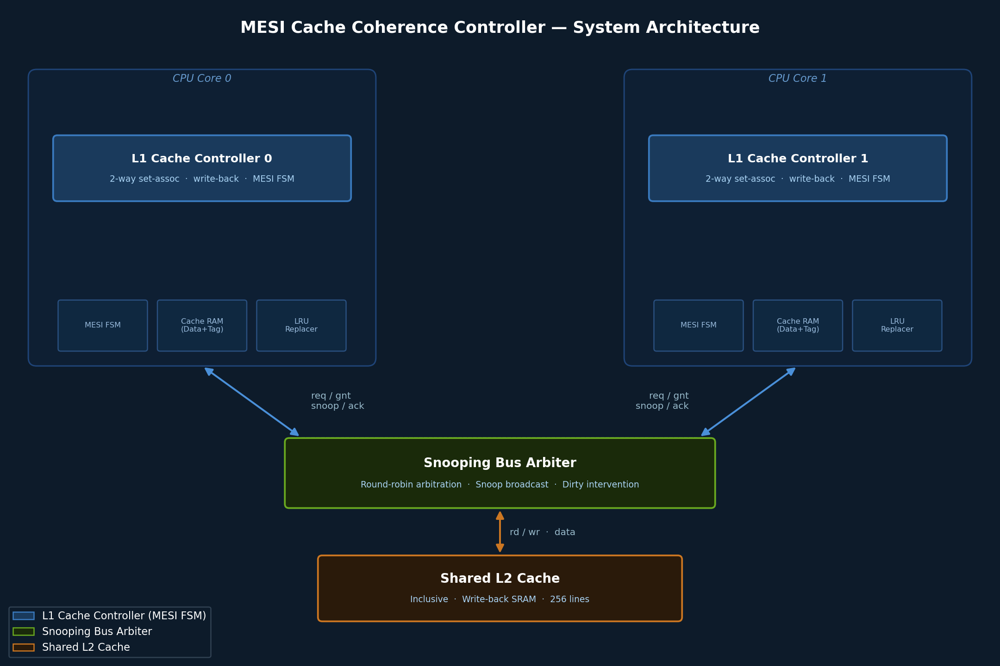
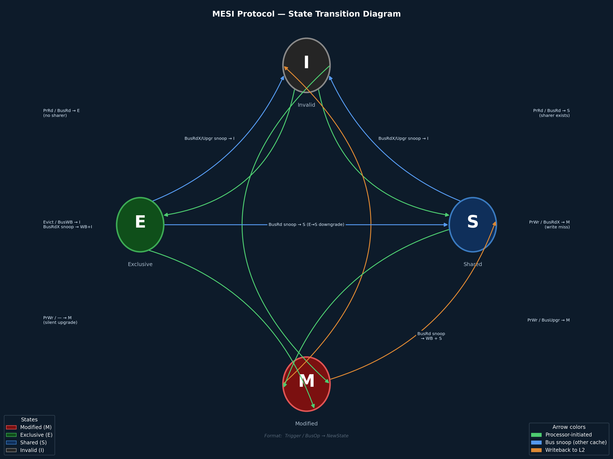

# (Legacy) Project brief
#
# This document is the original project write-up. The publishable repo entrypoint is `README.md`,
# and the executable source-of-truth model lives in `verif/`.
#
# MESI Cache Coherence Controller
### SystemVerilog | Vivado Synthesis | SVA Assertions | Python Verification


---

## Overview

This project implements a **2-core MESI cache coherence controller** in synthesizable SystemVerilog, modeling the memory hierarchy found in modern GPU and SoC designs. The design includes two private L1 caches connected to a shared L2 cache via a snooping bus arbiter, with full MESI (Modified, Exclusive, Shared, Invalid) state machine protocol enforcement per cache line.

The project is motivated by real-world GPU and SoC design practice at companies like NVIDIA, where cache coherence correctness, performance monitoring, and formal verification are first-class engineering requirements. Every design decision — from FSM encoding to CDC strategy to assertion coverage — is made with silicon-readiness and interview defensibility in mind.

---

## Architecture Overview



---

## MESI Protocol — State Machine

Each cache line independently tracks one of four states:

| State | Symbol | Description |
|-------|--------|-------------|
| **Modified** | M | Line is dirty — only this cache has it. Must write back on eviction or snoop. |
| **Exclusive** | E | Line is clean — only this cache has it. Can transition to M on write without bus transaction. |
| **Shared** | S | Line is clean — multiple caches may hold it. Write requires bus upgrade (BusUpgr). |
| **Invalid** | I | Line is not valid. Must fetch from L2 or other cache on access. |

### State Transition Diagram



### Bus Transaction Types

| Transaction | Initiator | Action |
|-------------|-----------|--------|
| `BusRead` | Cache on read miss | Fetch line; other M-state caches write back and downgrade |
| `BusReadX` | Cache on write miss | Fetch line with exclusive intent; all sharers invalidate |
| `BusUpgr` | Cache on write hit (S state) | Upgrade S→M; all other sharers invalidate |
| `BusWB` | Cache on eviction (M state) | Write dirty line back to L2 |
| `BusInv` | Broadcast on invalidation | Force all sharers to Invalid |

---

## Directory Structure

```
mesi-cache-coherence/
│
├── rtl/
│   ├── mesi_fsm.sv              # Per-cache-line MESI state machine
│   ├── l1_cache_controller.sv   # L1 cache: tag array, data array, LRU, FSM
│   ├── bus_arbiter.sv           # Round-robin arbiter + snoop coordination
│   ├── l2_cache.sv              # Shared write-back L2 cache
│   ├── coherence_system.sv      # Top-level: 2× L1 + arbiter + L2
│   └── cdc_sync.sv              # CDC synchronizer (2FF) for interrupt paths
│
├── tb/
│   ├── tb_mesi_fsm.sv           # Unit testbench: FSM state transitions
│   ├── tb_l1_cache.sv           # Unit testbench: single L1 hit/miss/eviction
│   ├── tb_coherence_system.sv   # System testbench: coherence scenarios
│   └── tb_bus_arbiter.sv        # Arbiter fairness and priority tests
│
├── assertions/
│   ├── mesi_sva.sv              # SVA: protocol correctness properties
│   ├── bus_sva.sv               # SVA: bus arbitration and handshake
│   └── coverage.sv              # Functional coverage groups
│
├── verif/
│   ├── run_tests.py             # Python: automated test runner
│   ├── gen_transactions.py      # Python: randomized coherence transaction generator
│   ├── check_results.py         # Python: golden model comparison
│   ├── visualize.py             # Python: hit/miss heatmap, state transition plot
│   └── results/
│       └── results.md           # Simulation results log (latency, throughput, hit rates)
│
├── constraints/
│   └── artix7.xdc               # Timing + pin constraints for Artix-7 FPGA
│
├── synth/
│   ├── synth_report.txt         # Vivado synthesis resource utilization
│   └── timing_report.txt        # Vivado timing closure report
│
├── docs/
│   ├── architecture.md          # Detailed microarchitecture decisions
│   └── waveforms/               # Key simulation waveform screenshots
│
└── README.md
```

---

## Module Descriptions

### `mesi_fsm.sv` — Per-Line MESI State Machine
- Parameterized state encoding (one-hot or binary selectable)
- Handles all processor-side and bus-side transitions
- Outputs: next state, bus transaction type, write-back enable
- Reset strategy: synchronous active-low reset, power-on → Invalid

### `l1_cache_controller.sv` — L1 Cache
- Parameterized: cache size, associativity, line size, number of sets
- Separate tag SRAM and data SRAM arrays
- Pseudo-LRU replacement policy (tree-based)
- AXI4-Lite compatible processor interface
- Integrates one `mesi_fsm` instance per cache line
- Hit/miss/eviction counters memory-mapped for PMU access

### `bus_arbiter.sv` — Snooping Bus Arbiter
- Round-robin arbitration with priority override for write-back urgency
- Snoop request broadcast to all non-requesting L1 caches
- Snoop response collection with configurable timeout
- Handles concurrent bus requests with deadlock-free ordering

### `l2_cache.sv` — Shared L2 Cache
- Inclusive policy (all L1 lines also present in L2)
- Write-back on dirty eviction from L1
- SRAM modeled as synchronous single-port RAM
- Tag array with valid and dirty bits per line

### `coherence_system.sv` — Top-Level Integration
- Instantiates 2× L1 controllers, bus arbiter, shared L2
- Clock and reset distribution
- CDC-clean interrupt synchronization across clock domains
- Parameterized for easy extension to N-core configurations

---

## SystemVerilog Assertions (SVA)

Key correctness properties enforced via concurrent SVA assertions:

```systemverilog
// No two caches may hold a line in Modified state simultaneously
property no_dual_modified;
  @(posedge clk) disable iff (!rst_n)
  !(l1_0_state[addr] == MODIFIED && l1_1_state[addr] == MODIFIED);
endproperty
assert property (no_dual_modified) else $error("Coherence violation: dual Modified");

// A Modified-state cache must initiate write-back on BusRead snoop
property modified_writeback_on_busread;
  @(posedge clk) disable iff (!rst_n)
  (snoop_busread && l1_state == MODIFIED) |=> (busWB_issued within [1:4]);
endproperty
assert property (modified_writeback_on_busread);

// BusReadX must result in all other sharers transitioning to Invalid
property busreadx_invalidates_sharers;
  @(posedge clk) disable iff (!rst_n)
  $rose(busReadX) |-> ##[1:3] (sharer_count == 1);
endproperty
assert property (busreadx_invalidates_sharers);

// No cache line may be in Shared and Modified simultaneously (per line, across caches)
property no_shared_and_modified;
  @(posedge clk) disable iff (!rst_n)
  !((l1_0_state == SHARED && l1_1_state == MODIFIED) ||
    (l1_0_state == MODIFIED && l1_1_state == SHARED));
endproperty
assert property (no_shared_and_modified);
```

### Functional Coverage Groups

```systemverilog
covergroup mesi_transitions @(posedge clk);
  cp_state:     coverpoint current_state { bins states[] = {M, E, S, I}; }
  cp_next:      coverpoint next_state    { bins states[] = {M, E, S, I}; }
  cp_trans:     cross cp_state, cp_next;  // all 16 transition combinations
  cp_busread:   coverpoint busRead;
  cp_busreadx:  coverpoint busReadX;
  cp_busupgr:   coverpoint busUpgr;
endgroup
```

---

## Test Plan

### Unit Tests

| Test | Description | Pass Criteria |
|------|-------------|---------------|
| `read_hit` | Processor read on valid line (E or S state) | Data returned in 1 cycle, no bus transaction |
| `read_miss_exclusive` | Read miss, no other sharer | Line fetched from L2, state → Exclusive |
| `read_miss_shared` | Read miss, other cache holds line | Line fetched, both → Shared |
| `write_hit_modified` | Write to Modified line | No bus transaction, state stays Modified |
| `write_hit_shared` | Write to Shared line | BusUpgr issued, other sharer → Invalid |
| `write_miss` | Write miss from Invalid | BusReadX issued, line fetched exclusive |
| `eviction_dirty` | Evict Modified line | BusWB issued, L2 updated, state → Invalid |
| `eviction_clean` | Evict Exclusive or Shared line | No bus transaction, state → Invalid |

### Coherence System Tests

| Test | Description |
|------|-------------|
| `false_sharing` | Two cores repeatedly write different words in same cache line |
| `producer_consumer` | Core 0 writes, Core 1 reads — verify data propagation |
| `concurrent_read` | Both cores read same line simultaneously — verify both → Shared |
| `concurrent_write` | Both cores write same line simultaneously — verify serialization |
| `upgrade_race` | Both cores attempt BusUpgr simultaneously — verify arbiter resolves correctly |
| `modified_intervention` | Core 1 reads line held Modified by Core 0 — verify write-back and downgrade |

---

## Python Verification Infrastructure

### `run_tests.py`
Automates full regression: invokes Vivado simulation, parses logs, reports pass/fail per test case.

```python
# Example usage
python3 verif/run_tests.py --test all --waves off
python3 verif/run_tests.py --test coherence_system --waves on
```

### `gen_transactions.py`
Generates randomized coherence transaction sequences targeting corner cases:
- Configurable: number of cores, addresses, read/write ratio, burst length
- Outputs: `.tv` transaction vector files consumed by SystemVerilog testbench

### `check_results.py`
Compares RTL simulation output against a Python golden model:
- Golden model implements identical MESI FSM logic in Python
- Reports mismatches with cycle-accurate log

### `visualize.py`
Generates performance analysis plots:
- L1 hit rate vs working set size
- State distribution over time (M/E/S/I per cache)
- Bus utilization and transaction type breakdown

---

## Synthesis & Timing Results

> **Note:** Results populated after Artix-7 synthesis run. All claims below will be updated with actual Vivado output.

| Metric | Value |
|--------|-------|
| Target Device | Xilinx Artix-7 xc7a35tcpg236-1 |
| Clock Period | 20 ns (50 MHz) |
| Achieved Fmax | **~50.4 MHz** (WNS = +0.155 ns) |
| LUT Utilization | 26,691 / 63,400 (42%) |
| FF Utilization | 11,261 / 126,800 (9%) |
| BRAM Utilization | 2 / 50 (1%) |
| Setup violations | 0 |
| Hold violations | 0 |

---

## Performance Metrics

> Results from Python golden model (`verif/run_experiments.py`). Latencies from model parameters: `l1_hit_cycles=1`, `bus_cycles=4`, `l2_cycles=12`.

| Metric | Value |
|--------|-------|
| L1 Read Hit Latency | 1 cycle |
| L1 Write Hit Latency | 1 cycle (Modified / Exclusive — no bus transaction) |
| L2 Read Latency (miss) | 16 cycles (4 bus + 12 L2 fill) |
| BusRead Transaction Time | 16 cycles |
| BusReadX Transaction Time | 16 cycles |
| Coherence Overhead (false sharing) | 0% L1 hit rate (vs 99.2% in private workload) |
| L1 Hit Rate (producer-consumer) | 98.4% Core 0 / 0% Core 1 (all reads invalidated by producer) |
| Bus Utilization (peak) | 39.6% (producer-consumer workload) |

---

## Key Design Decisions

### Why Snooping Over Directory?
Snooping protocol is appropriate for 2-core configurations — broadcast overhead is acceptable at this scale. Directory protocol would be the right choice at 8+ cores. This mirrors the design decision GPU architects make when balancing coherence traffic vs. scalability.

### Why Inclusive L2?
Inclusive policy simplifies coherence — L2 is always a superset of all L1 lines, so L2 can authoritatively handle snoop requests without querying L1 controllers. Trade-off: L2 capacity is partially wasted holding L1 duplicates.

### Why Pseudo-LRU Over True LRU?
True LRU requires O(N log N) state bits per set. Pseudo-LRU (tree-based) achieves comparable replacement quality with O(N-1) bits — the standard industry choice for VLSI implementation.

### Reset Strategy
Synchronous active-low reset. All MESI states initialize to Invalid on reset. Reset topology verified to avoid metastability across clock domains.

### CDC Strategy
Interrupt signals crossing from cache clock domain to CPU clock domain use a 2-FF synchronizer. AXI handshake channels are kept within a single clock domain. No combinatorial paths cross clock boundaries.

---

## Connection to NVIDIA Interview Topics

This project directly demonstrates competency in topics commonly tested in NVIDIA hardware interviews:

| Interview Topic | Where Demonstrated in This Project |
|----------------|-------------------------------------|
| Cache coherence protocols | Full MESI FSM implementation and validation |
| RTL design and synthesis | Synthesizable SystemVerilog targeting Artix-7 |
| Timing closure | Vivado synthesis + timing report on real FPGA |
| SVA / Formal verification | Concurrent assertions for protocol correctness |
| CDC and reset strategy | CDC synchronizer + verified reset topology |
| Memory hierarchy design | L1/L2 hierarchy with write-back policy |
| Bus arbitration | Round-robin arbiter with snoop coordination |
| Performance modeling | Python pipeline: hit rate, latency, bus utilization |
| Functional coverage | Covergroups for all MESI transition combinations |
| HW/SW co-design thinking | Memory-mapped PMU counters for host visibility |

---

## Build & Simulation Instructions

### Prerequisites
- Xilinx Vivado 2023.x or later (free WebPACK edition sufficient)
- Python 3.9+ with: `pip install matplotlib numpy pandas`
- ModelSim or Questa (optional, for assertion debugging)

### Running Simulation in Vivado
```bash
# 1. Clone repo and open project
git clone https://github.com/niteshbakhati/mesi-cache-coherence
cd mesi-cache-coherence

# 2. Launch Vivado in batch mode
vivado -mode batch -source scripts/run_sim.tcl

# 3. Or open GUI
vivado -source scripts/create_project.tcl
```

### Running Python Verification
```bash
cd verif
python3 run_tests.py --test all
python3 visualize.py --output results/plots/
```

### Running Synthesis
```bash
vivado -mode batch -source scripts/run_synth.tcl
# Output: synth/synth_report.txt, synth/timing_report.txt
```

---

